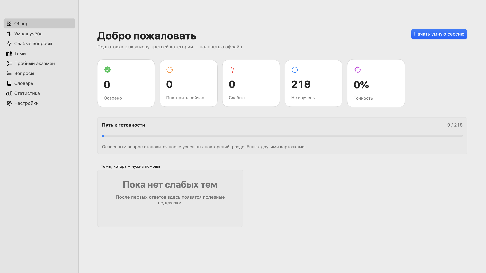
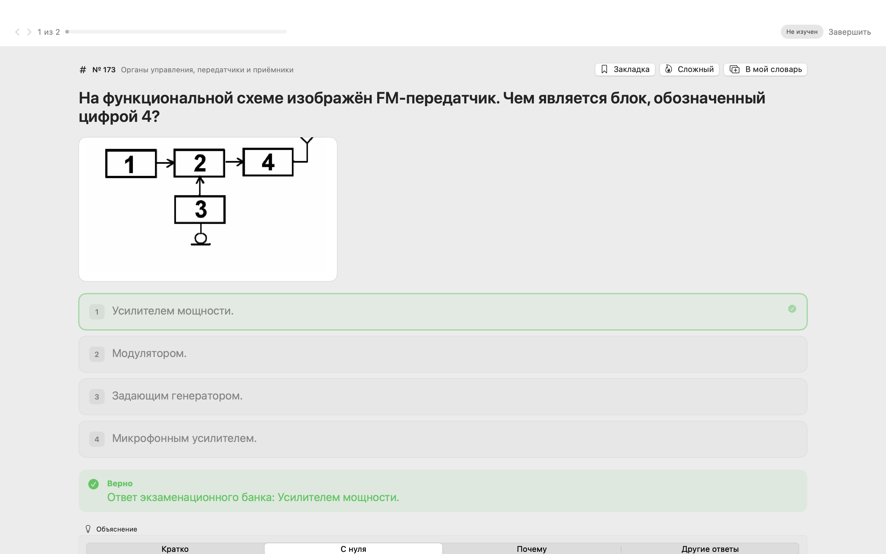
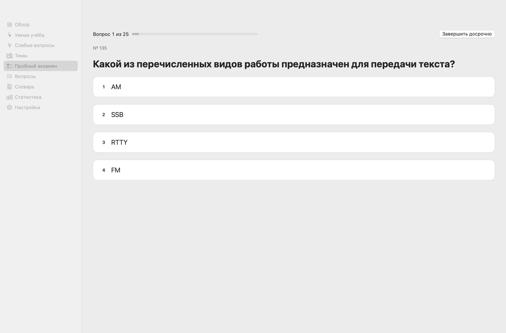
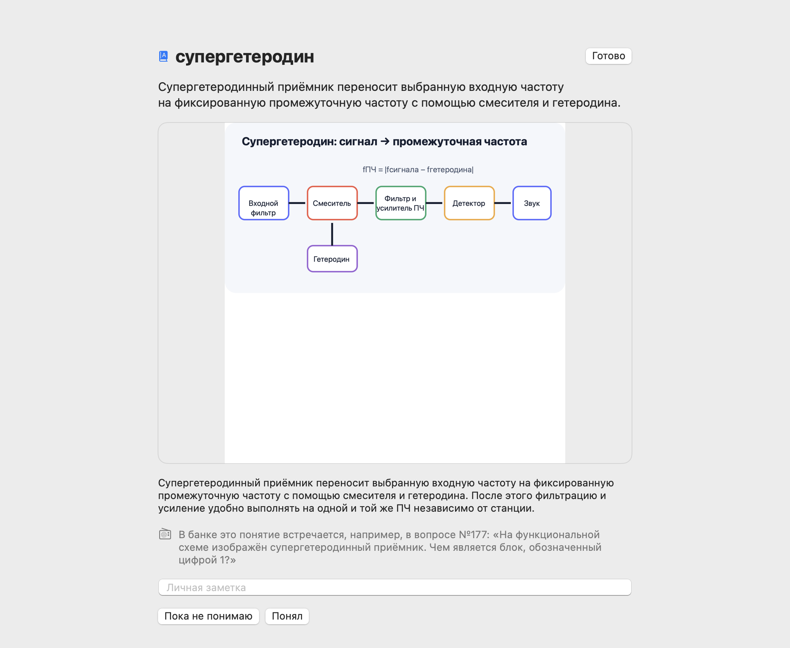
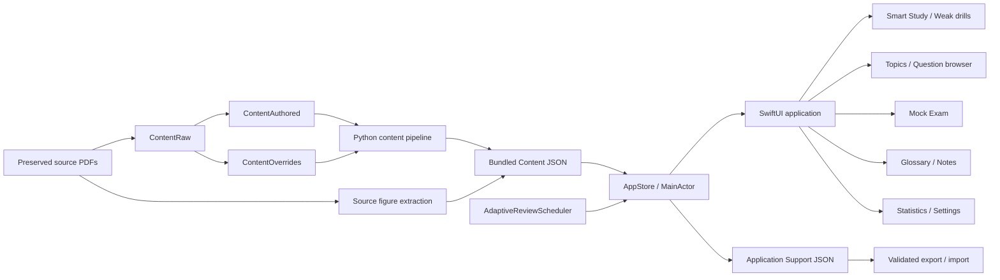

<p align="right">
  <a href="README.md">Русский</a> · <b>English</b>
</p>

# HAM Trainer 3

<p align="center">
  <b>Native offline macOS trainer for the Russian amateur-radio 3rd-category exam</b><br />
  218 source-traced questions · Adaptive spaced repetition · Mock exams · Glossary · Reproducible content pipeline
</p>

<p align="center">
  <a href="https://www.swift.org/"></a>
  <a href="https://developer.apple.com/xcode/swiftui/"></a>
  <a href="https://www.apple.com/macos/"></a>
  
  
  
</p>

<p align="center">
  <a href="TECHNICAL.md"><b>Technical documentation</b></a> ·
  <a href="docs/architecture.md">Architecture</a> ·
  <a href="docs/adaptive-scheduler.md">Adaptive scheduler</a> ·
  <a href="docs/content-audit.md">Content audit</a> ·
  <a href="docs/final-visual-qa.md">Visual QA</a>
</p>

## Overview

HAM Trainer 3 is a fully local native macOS application for preparing for the **Russian amateur-radio third-category examination**. It is built with SwiftUI and AppKit, does not require an account, network connection, telemetry service, backend, or API keys, and stores user progress only on the Mac.

The runtime bank contains exactly **218 selected third-category questions** from these exam-number ranges:

```text
1–34, 47–98, 100–135, 150–226, 387–391, 409–422
```

The application is not just a static quiz viewer. It combines an adaptive review scheduler, weak-question drills, a topic reference, source-aware explanations, a mock exam, built-in and personal glossaries, statistics, local JSON persistence, backup/import validation, and a reproducible content-generation and audit pipeline.

The previous detailed README has been preserved intact in **[TECHNICAL.md](TECHNICAL.md)**. This README is the portfolio/product overview; the technical file remains the compact operational reference for the exact bank, build commands, persistence path, content pipeline, audits, tests, and source-material notes.

## Product problem

Preparing from a raw question bank creates several practical problems:

- memorizing option positions is easier than learning the underlying radio concept;
- weak questions tend to be repeated either too quickly or not at all;
- a calendar-based spaced-repetition schedule is awkward during a concentrated exam-preparation session;
- official wording, educational explanations, source figures, and later practical notes can become mixed together;
- progress, notes, and personal terminology should remain available without requiring a cloud account;
- generated study content needs traceability back to preserved source documents rather than silently changing between builds.

HAM Trainer 3 addresses these problems with stable question/option identities, a question-distance scheduler, layered explanations, source references, local persistence, and a deterministic content pipeline with validation and audits.

## What this project demonstrates

- **Native macOS application engineering** with SwiftUI, AppKit panels, `NavigationSplitView`, keyboard shortcuts, adaptive layouts, local resources, app packaging, and a dedicated Xcode/SwiftPM target.
- **Adaptive-learning logic** implemented as domain code rather than a UI trick: explicit learning states, question-distance intervals, due eligibility, lapse handling, weak-question prioritization, topic balancing, maintenance limits, and within-session repeat guards.
- **State and persistence design** with a main-actor `AppStore`, Codable models, schema migration, atomic JSON writes, product-scoped backup identity, validation before import, and stable IDs independent of shuffled answer presentation.
- **Educational UX** with short/beginner/reasoning explanation layers, explanations for all three wrong options, memory hints, source details, question notes, bookmarks, hard-question flags, and mistake-reason tags.
- **Exam simulation** with 25 unique random questions, a 20/25 passing threshold, hidden explanations during the attempt, explicit unanswered tracking, stored result history, and post-exam error review.
- **Glossary and concept learning** with 127 built-in terms used by the bank, related questions/terms, “understood / unclear” concept progress, personal notes, and a separate editable personal glossary.
- **Content engineering and reproducibility** with preserved PDFs, normalized raw extraction, immutable checksum-verified authored educational data, explicit overrides, deterministic runtime generation, figure extraction, answer matching, SHA-256 checks, and machine-readable audits.
- **Testing and QA automation** with 55 native regression checks, scheduler simulations, content validators/audits, generated-file diff checks, reproducible source figures, visual snapshot tooling, GitHub Actions, and release-app assembly.

## Screenshots

<p align="center">
  
  
</p>

<p align="center">
  
  
</p>

More light/dark, typography, study-history, topic-reference, question-detail, source-figure, mock-result, and settings snapshots are stored under `docs/screenshots/final-qa/` and documented in **[docs/final-visual-qa.md](docs/final-visual-qa.md)**.

## Architecture



The architecture intentionally has **no networking layer**. `CategoryProfile` defines the product identity and exact exam contract; bundled `Content/` is immutable runtime study material; `AdaptiveReviewScheduler` owns eligibility and queue composition; `StudySession` owns same-session occurrences/history; `AppStore` is the persistence boundary; SwiftUI views consume store state without mutating generated content files.

Stable question and option IDs keep correctness and progress independent from shuffled option order. The application never determines correctness from a displayed letter or array index.

## Main application areas

| Area | Path | Purpose |
|---|---|---|
| Product contract | `HAMTrainer/CategoryProfile.swift` | Product name, exact 218-number bank, 25-question mock exam, 20/25 pass threshold, persistence namespace, and backup identity. |
| Domain models | `HAMTrainer/Models.swift` | Questions, options, source references, learning states, progress, glossary models, settings, backups, scores, and session summaries. |
| Adaptive scheduler | `HAMTrainer/AdaptiveReviewScheduler.swift` | Question-distance review ladder, eligibility, priorities, topic balancing, lapses, maintenance, session repeats, and mock-exam grading helpers. |
| Persistence / state | `HAMTrainer/AppStore.swift` | Bundled-content loading, progress recording, concept state, notes, personal glossary, mock results, JSON persistence, export/import, validation, and schema migration. |
| Main UI | `HAMTrainer/MainView.swift` | Dashboard, weak questions, topics, question browser/detail, statistics, settings, figures, source references, and global navigation. |
| Study / exam UI | `HAMTrainer/StudyViews.swift` | Smart Study, session runner/history, answer flow, explanations, mistake tagging, session summary, and mock exam. |
| Glossary UI | `HAMTrainer/GlossaryViews.swift` | Built-in concepts, weak/learned states, personal glossary CRUD, local notes, search, and related-question links. |
| Typography / visual QA | `HAMTrainer/ReadingTypography.swift`, `SnapshotCaptureView.swift` | Reading-size metrics and opt-in deterministic screenshot capture for UI QA. |
| Runtime content | `Content/` | Generated immutable question bank, topic metadata, glossary, source map, exam figures, and teaching diagrams bundled with the app. |
| Authored content | `ContentAuthored/` | Checksum-verified authored explanations and glossary source records. |
| Content tooling | `Tools/` | Import/build pipeline, validation, audits, source-figure extraction, icon generation, tests, and `.app` build scripts. |
| QA / provenance | `docs/` | Architecture, scheduler specification, content/answer audits, source provenance, testing notes, and final visual QA. |

## Adaptive learning model

HAM Trainer 3 measures review distance by **completed cards**, not by wall-clock days. The persisted global `studyStep` increases exactly once for each graded answer.

The review ladder is:

```text
5 → 10 → 20 → 40 → 80 other completed cards
```

A question answered at step `100` with distance `5` receives `nextDueStudyStep = 106`: steps `101–105` must be completed by other cards before that question is eligible again.

### Learning states

```text
unseen → learning / review → mastered
              ↘ weak ↗
```

The scheduler tracks attempts, correct/incorrect/“don't know”/revealed counts, consecutive correct answers, successful spaced reviews, lapses, review stage, last outcome, failure time, next due step, bookmarks, manually hard state, notes, and mistake-reason metadata.

### Smart Study priority

Eligible cards are composed in this order:

```text
lapse → weak → due → new → limited maintenance
```

Important invariants:

- a first correct answer schedules the first five-card distance;
- only a **due** successful review advances the review stage;
- an early manual correct answer does not incorrectly upgrade the spaced-repetition stage;
- after the 80-card level and enough successful due reviews, the question becomes `mastered`;
- incorrect, “Don't know”, or revealing the answer before attempting resets the ladder and marks the item weak/learning as appropriate;
- non-due mastered cards are not fabricated as filler when there is nothing legitimately due;
- maintenance cards are capped to a small part of the queue;
- within each priority, topic balancing prevents one topic from dominating a session.

### Same-session repeat protection

After a failed answer, `StudySession` attempts to insert the question only after **five other cards**. If a short session cannot satisfy that gap, the repeat is not inserted. A normal session limits a question to two appearances; a dedicated weak-question drill allows up to three. Smart Study recalculates the unseen remainder after each completed answer, so a question that legitimately becomes due can return later in the same long session.

The full algorithm and invariants are documented in **[docs/adaptive-scheduler.md](docs/adaptive-scheduler.md)**.

## Study and reference features

### Smart Study

- Session lengths of 10, 20, 30, or 40 questions.
- Dynamic queue reconsideration after every graded answer.
- Explicit reason for selection: new, weak, due, lapse, maintenance, manual, or session mistake.
- Back/forward session history without mutating scheduler progress.
- Answer-option shuffling while preserving stable option identity.
- Session summary with correct, incorrect, “Don't know”, revealed, weakened, improved, mastered, hard-topic, and unclear-concept information.
- Direct follow-up actions for session mistakes, weak questions, or another Smart Study session.

### Explanations

Every runtime question can carry:

- a short explanation;
- a beginner-oriented “from zero” explanation;
- a reasoning/“why” explanation;
- an explanation for each incorrect option;
- a memory hint;
- built-in glossary links;
- exam/source figures and separate teaching diagrams;
- source document/page metadata;
- an optional practical/legal historical note kept distinct from the bank answer.

### Weak questions and mistakes

Weak-question filters include all weak items, recent failures, “Don't know”, historical errors, and manually marked hard questions. Intensive drills can run 1, 3, or 5 rounds. A user can optionally label a failure reason such as unknown term, forgotten fact, missed principle, calculation error, misread question, or guess.

### Topics and question browser

The bank is grouped into 14 subject areas covering radio operation, regulation, antennas, propagation, modulation, electronics, safety, international rules, Q-codes, equipment, and related material. Topic reference pages show the bank answer immediately without recording study progress; a separate action starts training. The global question browser searches locally across question text, options, explanations, topic, glossary terms, and personal notes, with filters for unseen, due, weak, previously incorrect, and bookmarked questions.

### Mock exam

- 25 unique random questions from the exact third-category bank.
- Passing threshold: **20 / 25**.
- Answer explanations remain hidden during the attempt.
- Submitted answers and unanswered questions are tracked separately.
- Results are stored locally and shown in statistics.
- Incorrect submitted answers can be reviewed after completion.

### Glossary

The generated bank currently includes **127 built-in glossary entries actually referenced by the 218-question set**. Each term can include aliases, short definition, beginner explanation, radio-specific example, related terms, a teaching diagram, personal note, and related question links. Concept progress distinguishes unclear and understood terms. A separate personal glossary supports create/edit/delete, notes, examples, and related-question IDs.

## Local persistence and privacy

The app writes progress to:

```text
~/Library/Application Support/HAMTrainer3/progress-v1.json
```

The current persistence schema is version 3. The stored model includes question progress, concept progress, personal glossary entries, mock-exam history, study step, and user settings. JSON writes are atomic.

Backups carry the product identity `HAMTrainer3`. Import validates schema version, product identity, non-negative study step, personal glossary records, and question IDs before replacing current state. This prevents accidental import of progress from another category/application. Legacy progress structures are migrated before use.

The normal application performs no network requests. There is no account, cloud synchronization, telemetry endpoint, advertising SDK, or API-key requirement; user progress remains local unless the user explicitly exports a JSON backup.

## Content pipeline and provenance

The repository deliberately separates preserved source material from generated runtime data:

```text
ExamSources/
    ↓
ContentRaw/                 normalized extraction
    ↓
ContentAuthored/            immutable checksum-verified educational layer
    +
ContentOverrides/           explicit source-checked corrections
    ↓
Tools/build_content.py
    ↓
Content/                    runtime bank bundled with the app
```

Current audited result:

| Check | Result |
|---|---:|
| Runtime questions | 218 |
| Authored educational records | 218 / 218 |
| Fallback-generated educational records | 0 |
| Correct option IDs resolved | 218 / 218 |
| Answer matches | 215 exact + 3 explicit manual + 0 fuzzy |
| Built-in glossary entries | 127 |
| Exam figures | 4 shared source figures |
| Teaching diagrams | 7 |
| Missing required assets | 0 |

`source-map.json` links cards back to source documents/pages. `extract_figures.py` regenerates source figures using fixed crop specifications; the generated figure manifest and CI diff check verify reproducibility. Source PDFs are preserved separately, and their hashes/provenance are documented in **[docs/source-provenance.md](docs/source-provenance.md)**. The repository does not assign its source-code license to those preserved third-party documents.

## Tech stack

| Layer | Technologies |
|---|---|
| Desktop UI | SwiftUI, AppKit, SF Symbols |
| Language / runtime | Swift, Foundation, Combine |
| State | `ObservableObject`, `@StateObject`, `@EnvironmentObject`, main-actor `AppStore` |
| Persistence | Codable, JSONEncoder/JSONDecoder, FileManager, atomic local writes |
| Learning logic | Custom deterministic `AdaptiveReviewScheduler` + `StudySession` |
| Data tooling | Python 3 content import/build/validation/audit scripts |
| Source figures | PDF extraction pipeline, Poppler in CI, PNG/SVG assets |
| Build | Swift Package Manager, Xcode project, shell packaging scripts |
| Testing | Custom native Swift regression runner, 500-answer scheduler simulation, content validators/audits |
| CI | GitHub Actions on macOS 14, reproducibility diffs, tests, audits, release-app build |
| Runtime networking | None |

## Repository structure

```text
HAM-Trainer-3/
├── HAMTrainer/                   # Native SwiftUI application
│   ├── HAMTrainerApp.swift       # App entry point, commands, snapshot launch modes
│   ├── CategoryProfile.swift     # Exact category-3 product/exam contract
│   ├── Models.swift              # Domain, progress, backup and exam models
│   ├── AdaptiveReviewScheduler.swift
│   ├── AppStore.swift            # Local state + persistence boundary
│   ├── MainView.swift            # Main navigation/reference/settings UI
│   ├── StudyViews.swift          # Smart Study + Mock Exam workflows
│   ├── GlossaryViews.swift       # Built-in and personal glossary
│   └── SnapshotCaptureView.swift # Opt-in visual QA screenshots
├── Content/                      # Generated immutable runtime bank/assets
├── ContentRaw/                   # Normalized source extraction
├── ContentAuthored/              # Checksum-verified authored educational data
├── ContentOverrides/             # Explicit source-cleanup/mapping corrections
├── ExamSources/                  # Preserved source documents + source notes
├── Tests/RunTests.swift          # Native regression test runner
├── Tools/                        # Build, import, validation, audit and QA scripts
├── docs/                         # Architecture, scheduler, audits, provenance, screenshots
├── HAMTrainer3.xcodeproj/        # Xcode project
├── Package.swift                 # SwiftPM executable target + Content resources
├── TECHNICAL.md                  # Preserved previous detailed README
└── .github/workflows/ci.yml      # macOS reproducibility/test/build pipeline
```

## Quick start

### Requirements

- macOS 14 or newer
- Xcode Command Line Tools or Xcode with a compatible Swift toolchain
- Git

No database, backend, account, network service, or environment file is required.

### Clone and verify

```bash
git clone https://github.com/Leo0742/HAM-Trainer-3.git
cd HAM-Trainer-3

Tools/run_tests.sh
```

### Build the application

```bash
Tools/build_app.sh
open "Build/HAM Trainer 3.app"
```

The build script creates the `.app`, application icon, and local ad-hoc signature. The project can also be opened as `HAMTrainer3.xcodeproj`; target/scheme and executable identity use `HAMTrainer3`.

## Content rebuild and audits

To reproduce the runtime content manually:

```bash
python3 Tools/build_content.py
python3 Tools/validate_content.py
python3 Tools/audit_answer_matches.py
python3 Tools/audit_content.py
```

The audit outputs live under `docs/`, including machine-readable JSON and human-readable Markdown reports. A correct rebuild should not introduce an unexpected diff in generated content.

## Testing and CI

`Tools/run_tests.sh` executes **55 native checks**, including scheduler invariants, persistence/restart behavior, repeat gaps and caps, session history, exact bank integrity, mock exam behavior, glossary/content expectations, backup isolation, required figures, and a long scheduler simulation.

GitHub Actions runs on macOS 14 and performs the following pipeline:

```text
build exact category-3 content
        ↓
regenerate source figures from preserved PDF
        ↓
validate bank + glossary + figure manifest + assets
        ↓
require zero diff for regenerated figures
        ↓
audit answer matching
        ↓
audit authored content + source hashes
        ↓
require reproducible generated files
        ↓
run Swift regression tests + scheduler simulation
        ↓
build release app
```

Visual QA is also reproducible: `SnapshotCaptureView` is inert during normal launches and activates only with explicit snapshot arguments, allowing controlled window size, appearance, content mode, and PNG output for the final screenshot suite.

## Technical documentation

The original README was intentionally preserved rather than overwritten. **[TECHNICAL.md](TECHNICAL.md)** contains that previous technical overview unchanged, including:

- exact third-category ranges;
- `5 → 10 → 20 → 40 → 80` review distances;
- build commands and `.app` packaging notes;
- persistence path and backup identity;
- source/content pipeline commands;
- current 218/218, glossary and answer-match audit results;
- 55-check test-suite summary;
- source-material and rights notes.

Additional focused references are available in:

- **[docs/architecture.md](docs/architecture.md)** — runtime boundaries and main application flows;
- **[docs/adaptive-scheduler.md](docs/adaptive-scheduler.md)** — scheduler invariants and Smart Study behavior;
- **[docs/content-audit.md](docs/content-audit.md)** — current structural/content audit;
- **[docs/answer-match-audit.md](docs/answer-match-audit.md)** — source answer-resolution audit;
- **[docs/source-provenance.md](docs/source-provenance.md)** — source priority, hashes and reproducibility;
- **[docs/final-visual-qa.md](docs/final-visual-qa.md)** — final UI snapshot matrix/checklist.

## Status

HAM Trainer 3 is a working native macOS study application with the exact 218-question third-category bank, adaptive question-distance review, weak-question training, mock exams, topic/reference browsing, layered explanations, built-in/personal glossaries, local statistics and backup, reproducible content generation, automated audits, native regression tests, and a complete visual-QA screenshot set.

The current build is intentionally local-first and optimized for personal exam preparation. It is not presented as an official application of a regulator or amateur-radio organization; source provenance and the distinction between bank answers, educational explanations, and practical/legal notes are kept explicit in the repository.

## Why it matters for review

For recruiters or engineering reviewers, this project demonstrates practical work across:

- native Swift/SwiftUI desktop development and macOS UX;
- non-trivial deterministic scheduling/state-machine logic;
- local persistence, data migration, backups, validation, and stable identity design;
- domain modeling for a real learning workflow rather than a CRUD-only application;
- reproducible ETL/content-generation tooling in Python;
- provenance, checksum verification, audit outputs, and generated-data invariants;
- native regression testing, long-run scheduler simulation, visual QA, CI, and app packaging;
- privacy-oriented architecture with zero runtime networking and no external service dependency.