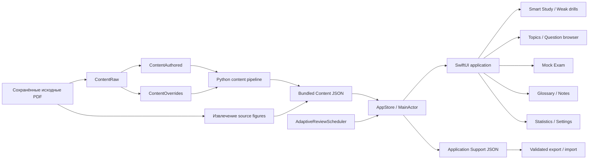

<p align="right">
  <b>Русский</b> · <a href="README.en.md">English</a>
</p>

# HAM Trainer 3

<p align="center">
  <b>Нативный офлайн-тренажёр для экзамена радиолюбителя 3-й категории в России</b><br />
  218 вопросов с привязкой к источникам · Адаптивное интервальное повторение · Пробные экзамены · Словарь · Воспроизводимый content pipeline
</p>

<p align="center">
  <a href="https://www.swift.org/"></a>
  <a href="https://developer.apple.com/xcode/swiftui/"></a>
  <a href="https://www.apple.com/macos/"></a>
  
  
  
</p>

<p align="center">
  <a href="TECHNICAL.md"><b>Техническая документация</b></a> ·
  <a href="docs/architecture.md">Архитектура</a> ·
  <a href="docs/adaptive-scheduler.md">Адаптивный scheduler</a> ·
  <a href="docs/content-audit.md">Аудит контента</a> ·
  <a href="docs/final-visual-qa.md">Visual QA</a>
</p>

## Обзор

HAM Trainer 3 — полностью локальное нативное приложение для macOS, предназначенное для подготовки к **экзамену радиолюбителя третьей категории в России**. Оно построено на SwiftUI и AppKit, не требует аккаунта, подключения к сети, telemetry service, backend или API-ключей и хранит пользовательский прогресс только на Mac.

Runtime-банк содержит ровно **218 выбранных вопросов третьей категории** из следующих диапазонов номеров:

```text
1–34, 47–98, 100–135, 150–226, 387–391, 409–422
```

Приложение — не просто просмотрщик тестов. Оно объединяет adaptive review scheduler, отдельную тренировку слабых вопросов, тематический справочник, объяснения с привязкой к источникам, пробный экзамен, встроенный и персональный словари, статистику, локальное JSON-хранилище, проверяемый импорт/экспорт backup и воспроизводимый pipeline генерации и аудита контента.

Предыдущий подробный README полностью сохранён в **[TECHNICAL.md](TECHNICAL.md)**. Текущий README служит как portfolio/product overview, а технический файл остаётся компактной эксплуатационной справкой по точному банку, командам сборки, пути хранения прогресса, content pipeline, аудитам, тестам и исходным материалам.

## Проблема, которую решает проект

Подготовка по «сырому» банку вопросов создаёт несколько практических проблем:

- легче запомнить расположение вариантов, чем понять радиотехнический принцип;
- слабые вопросы часто повторяются либо слишком быстро, либо слишком редко;
- календарное spaced repetition неудобно при интенсивной подготовке к экзамену в рамках одной сессии;
- официальные формулировки, учебные объяснения, исходные рисунки и более поздние практические примечания могут смешиваться;
- прогресс, заметки и собственные термины должны быть доступны без облачного аккаунта;
- сгенерированный учебный контент должен оставаться трассируемым до сохранённых исходных документов и не меняться незаметно между сборками.

HAM Trainer 3 решает эти задачи через стабильные идентификаторы вопросов и вариантов, scheduler с расстоянием в количестве карточек, многоуровневые объяснения, ссылки на источники, локальное хранение и детерминированный content pipeline с валидацией и аудитами.

## Что демонстрирует проект

- **Разработка нативного macOS-приложения** на SwiftUI с AppKit panels, `NavigationSplitView`, keyboard shortcuts, адаптивными layout, локальными resources, упаковкой приложения и отдельным Xcode/SwiftPM target.
- **Adaptive-learning логику**, реализованную как отдельный domain layer, а не как UI-эффект: явные learning states, question-distance intervals, due eligibility, обработка lapse, приоритизация weak questions, балансировка тем, maintenance limits и защита от слишком частого повтора внутри сессии.
- **Проектирование state и persistence** с main-actor `AppStore`, Codable-моделями, schema migration, атомарными JSON-записями, product-scoped backup identity, проверкой перед импортом и стабильными ID, не зависящими от перемешивания вариантов.
- **Учебный UX** с уровнями объяснения «кратко / с нуля / почему», разбором всех трёх неправильных вариантов, memory hints, source details, личными заметками, bookmarks, флагами сложных вопросов и тегами причин ошибки.
- **Симуляцию экзамена** с 25 уникальными случайными вопросами, проходным порогом 20/25, скрытыми объяснениями во время попытки, отдельным учётом неотвеченных, сохранением истории результатов и разбором ошибок после завершения.
- **Словарь и изучение понятий** со 127 встроенными терминами, реально используемыми банком, связанными вопросами и терминами, состояниями «понял / неясно», личными заметками и отдельным редактируемым персональным словарём.
- **Content engineering и воспроизводимость** с сохранёнными PDF, нормализованным raw extraction, неизменяемым checksum-verified authored layer, явными overrides, детерминированной генерацией runtime-данных, извлечением изображений, answer matching, SHA-256 checks и machine-readable audits.
- **Автоматизацию testing и QA** с 55 нативными regression checks, симуляциями scheduler, content validators/audits, проверкой diff для generated files, воспроизводимыми source figures, visual snapshot tooling, GitHub Actions и сборкой release app.

## Скриншоты

<p align="center">
  
  
</p>

<p align="center">
  
  
</p>

Дополнительные screenshots для light/dark mode, typography, study history, topic reference, question detail, source figures, mock results и settings находятся в `docs/screenshots/final-qa/` и описаны в **[docs/final-visual-qa.md](docs/final-visual-qa.md)**.

## Архитектура



В архитектуре намеренно **нет сетевого слоя**. `CategoryProfile` задаёт identity продукта и точный экзаменационный контракт; bundled `Content/` — неизменяемый runtime-материал; `AdaptiveReviewScheduler` отвечает за eligibility и состав очереди; `StudySession` — за появления карточек и историю внутри конкретной сессии; `AppStore` является persistence boundary; SwiftUI views читают состояние store и не изменяют generated content files.

Стабильные ID вопросов и вариантов сохраняют корректность и прогресс независимо от перемешивания порядка ответов. Приложение никогда не определяет правильность по отображаемой букве или индексу массива.

## Основные части приложения

| Область | Путь | Назначение |
|---|---|---|
| Product contract | `HAMTrainer/CategoryProfile.swift` | Название продукта, точный набор 218 вопросов, mock exam на 25 вопросов, порог 20/25, persistence namespace и backup identity. |
| Domain models | `HAMTrainer/Models.swift` | Вопросы, варианты, source references, learning states, progress, glossary models, settings, backups, scores и session summaries. |
| Adaptive scheduler | `HAMTrainer/AdaptiveReviewScheduler.swift` | Question-distance ladder, eligibility, priorities, topic balancing, lapses, maintenance, повторы внутри сессии и helpers для grading mock exam. |
| Persistence / state | `HAMTrainer/AppStore.swift` | Загрузка bundled content, запись progress, concept state, notes, personal glossary, mock results, JSON persistence, export/import, validation и schema migration. |
| Main UI | `HAMTrainer/MainView.swift` | Dashboard, weak questions, topics, question browser/detail, statistics, settings, figures, source references и глобальная навигация. |
| Study / exam UI | `HAMTrainer/StudyViews.swift` | Smart Study, session runner/history, answer flow, explanations, mistake tagging, session summary и mock exam. |
| Glossary UI | `HAMTrainer/GlossaryViews.swift` | Built-in concepts, weak/learned states, personal glossary CRUD, локальные notes, search и ссылки на связанные вопросы. |
| Typography / visual QA | `HAMTrainer/ReadingTypography.swift`, `SnapshotCaptureView.swift` | Метрики размеров текста и opt-in детерминированный screenshot capture для UI QA. |
| Runtime content | `Content/` | Сгенерированный immutable question bank, metadata тем, glossary, source map, exam figures и teaching diagrams, упакованные с приложением. |
| Authored content | `ContentAuthored/` | Checksum-verified authored explanations и исходные записи glossary. |
| Content tooling | `Tools/` | Import/build pipeline, validation, audits, source-figure extraction, icon generation, tests и `.app` build scripts. |
| QA / provenance | `docs/` | Architecture, scheduler specification, content/answer audits, source provenance, testing notes и final visual QA. |

## Модель адаптивного обучения

HAM Trainer 3 измеряет расстояние до повторения **числом завершённых карточек**, а не календарными днями. Сохраняемый глобальный `studyStep` увеличивается ровно один раз на каждый оценённый ответ.

Лестница повторений:

```text
5 → 10 → 20 → 40 → 80 других завершённых карточек
```

Если вопрос отвечен на шаге `100` с расстоянием `5`, он получает `nextDueStudyStep = 106`: прежде чем он снова станет доступен, должны быть завершены шаги `101–105` на других карточках.

### Состояния обучения

```text
unseen → learning / review → mastered
              ↘ weak ↗
```

Scheduler отслеживает attempts, correct/incorrect/“don't know”/revealed counts, consecutive correct answers, successful spaced reviews, lapses, review stage, last outcome, failure time, next due step, bookmarks, manually hard state, notes и mistake-reason metadata.

### Приоритет Smart Study

Доступные карточки формируются в таком порядке:

```text
lapse → weak → due → new → limited maintenance
```

Ключевые инварианты:

- первый правильный ответ назначает первое расстояние в пять карточек;
- только успешный **due**-повтор продвигает review stage;
- ранний ручной правильный ответ не должен ошибочно улучшать spaced-repetition stage;
- после уровня 80 и достаточного числа успешных due reviews вопрос становится `mastered`;
- неправильный ответ, “Don't know” или просмотр ответа до собственной попытки сбрасывает ladder и переводит вопрос в weak/learning в зависимости от состояния;
- non-due mastered cards не подставляются как filler, если реально созревших карточек нет;
- maintenance cards ограничены небольшой долей очереди;
- внутри каждого приоритета topic balancing не даёт одной теме захватить большую часть сессии.

### Защита от повторов в одной сессии

После ошибочного ответа `StudySession` пытается вставить вопрос только после **пяти других карточек**. Если короткая сессия не позволяет соблюсти это расстояние, повтор не добавляется. В обычной сессии один вопрос может появиться максимум два раза; специальная тренировка слабых вопросов разрешает до трёх появлений. Smart Study пересчитывает ещё не показанную часть очереди после каждого завершённого ответа, поэтому вопрос, который действительно стал due, может вернуться позже в той же длинной сессии.

Полный алгоритм и его инварианты описаны в **[docs/adaptive-scheduler.md](docs/adaptive-scheduler.md)**.

## Учёба и справочные возможности

### Smart Study

- Длина сессии: 10, 20, 30 или 40 вопросов.
- Динамический пересчёт очереди после каждого оценённого ответа.
- Явная причина выбора: new, weak, due, lapse, maintenance, manual или session mistake.
- Навигация назад/вперёд по истории сессии без изменения scheduler progress.
- Перемешивание вариантов при сохранении стабильной identity варианта.
- Session summary с correct, incorrect, “Don't know”, revealed, weakened, improved, mastered, hard-topic и unclear-concept информацией.
- Прямые действия для разбора ошибок текущей сессии, слабых вопросов или запуска следующей Smart Study session.

### Объяснения

Каждый runtime-вопрос может содержать:

- краткое объяснение;
- объяснение «с нуля» для новичка;
- reasoning / объяснение «почему»;
- отдельное объяснение каждого неправильного варианта;
- memory hint;
- ссылки на встроенный glossary;
- exam/source figures и отдельные teaching diagrams;
- metadata исходного документа и страницы;
- опциональное практическое/правовое историческое примечание, которое хранится отдельно от ответа банка.

### Слабые вопросы и ошибки

Фильтры weak questions включают все слабые вопросы, недавние ошибки, “Don't know”, исторические ошибки и вопросы, вручную отмеченные как сложные. Intensive drills могут запускаться на 1, 3 или 5 кругов. Пользователь может дополнительно пометить причину ошибки: неизвестный термин, забытый факт, непонятый принцип, ошибка в расчёте, невнимательное чтение или угадывание.

### Темы и браузер вопросов

Банк разделён на 14 тематических областей: проведение радиосвязи, российские и международные правила, антенны, распространение радиоволн, модуляция, электроника, безопасность, Q-коды, аппаратура и связанные темы. В topic reference правильный ответ банка виден сразу и не записывает учебный прогресс; отдельная кнопка запускает тренировку. Глобальный question browser выполняет локальный поиск по формулировке, вариантам, объяснениям, теме, терминам glossary и личным заметкам и поддерживает фильтры unseen, due, weak, previously incorrect и bookmarked.

### Пробный экзамен

- 25 уникальных случайных вопросов из точного банка третьей категории.
- Проходной результат: **20 / 25**.
- Объяснения ответов скрыты до завершения попытки.
- Отправленные ответы и вопросы без ответа учитываются отдельно.
- Результаты сохраняются локально и отображаются в статистике.
- Ошибочные отправленные ответы можно разобрать после завершения.

### Словарь

Сгенерированный банк сейчас содержит **127 встроенных терминов, реально используемых набором из 218 вопросов**. Для каждого термина могут храниться aliases, short definition, объяснение для новичка, radio-specific example, related terms, teaching diagram, личная заметка и ссылки на связанные вопросы. Concept progress различает непонятные и изученные термины. Отдельный персональный словарь поддерживает create/edit/delete, notes, examples и related-question IDs.

## Локальное хранение и приватность

Приложение сохраняет прогресс по пути:

```text
~/Library/Application Support/HAMTrainer3/progress-v1.json
```

Текущая версия persistence schema — 3. Сохраняемая модель включает question progress, concept progress, personal glossary entries, историю mock exams, study step и user settings. JSON записывается атомарно.

Backup-файлы содержат product identity `HAMTrainer3`. Перед заменой текущего состояния импорт проверяет schema version, product identity, неотрицательный study step, записи personal glossary и question IDs. Это предотвращает случайный импорт прогресса из другой категории или другого приложения. Legacy progress structures мигрируются перед использованием.

Обычный запуск приложения не выполняет сетевых запросов. Нет аккаунта, cloud synchronization, telemetry endpoint, advertising SDK или требований к API key; прогресс остаётся локальным, пока пользователь сам явно не экспортирует JSON backup.

## Content pipeline и происхождение данных

Репозиторий намеренно разделяет сохранённые исходные материалы и сгенерированные runtime-данные:

```text
ExamSources/
    ↓
ContentRaw/                 нормализованное извлечение
    ↓
ContentAuthored/            неизменяемый checksum-verified образовательный слой
    +
ContentOverrides/           явные source-checked исправления
    ↓
Tools/build_content.py
    ↓
Content/                    runtime-банк, упакованный с приложением
```

Текущий результат аудита:

| Проверка | Результат |
|---|---:|
| Runtime questions | 218 |
| Authored educational records | 218 / 218 |
| Fallback-generated educational records | 0 |
| Resolved correct option IDs | 218 / 218 |
| Answer matches | 215 exact + 3 explicit manual + 0 fuzzy |
| Built-in glossary entries | 127 |
| Exam figures | 4 общих source figures |
| Teaching diagrams | 7 |
| Missing required assets | 0 |

`source-map.json` связывает карточки с исходными документами и страницами. `extract_figures.py` воспроизводимо пересобирает source figures по фиксированным crop specifications; сгенерированный figure manifest и CI diff check подтверждают воспроизводимость. Source PDFs хранятся отдельно, а их hashes/provenance описаны в **[docs/source-provenance.md](docs/source-provenance.md)**. Лицензия исходного кода репозитория не распространяется автоматически на эти сохранённые сторонние документы.

## Технологический стек

| Слой | Технологии |
|---|---|
| Desktop UI | SwiftUI, AppKit, SF Symbols |
| Language / runtime | Swift, Foundation, Combine |
| State | `ObservableObject`, `@StateObject`, `@EnvironmentObject`, main-actor `AppStore` |
| Persistence | Codable, JSONEncoder/JSONDecoder, FileManager, atomic local writes |
| Learning logic | Custom deterministic `AdaptiveReviewScheduler` + `StudySession` |
| Data tooling | Python 3 scripts для content import/build/validation/audit |
| Source figures | PDF extraction pipeline, Poppler в CI, PNG/SVG assets |
| Build | Swift Package Manager, Xcode project, shell packaging scripts |
| Testing | Custom native Swift regression runner, симуляция scheduler на 500 ответов, content validators/audits |
| CI | GitHub Actions на macOS 14, reproducibility diffs, tests, audits, release-app build |
| Runtime networking | Отсутствует |

## Структура репозитория

```text
HAM-Trainer-3/
├── HAMTrainer/                   # Нативное SwiftUI-приложение
│   ├── HAMTrainerApp.swift       # App entry point, commands, snapshot launch modes
│   ├── CategoryProfile.swift     # Точный product/exam contract третьей категории
│   ├── Models.swift              # Domain, progress, backup и exam models
│   ├── AdaptiveReviewScheduler.swift
│   ├── AppStore.swift            # Локальный state + persistence boundary
│   ├── MainView.swift            # Main navigation/reference/settings UI
│   ├── StudyViews.swift          # Smart Study + Mock Exam workflows
│   ├── GlossaryViews.swift       # Built-in и personal glossary
│   └── SnapshotCaptureView.swift # Opt-in visual QA screenshots
├── Content/                      # Generated immutable runtime bank/assets
├── ContentRaw/                   # Normalized source extraction
├── ContentAuthored/              # Checksum-verified authored educational data
├── ContentOverrides/             # Explicit source-cleanup/mapping corrections
├── ExamSources/                  # Сохранённые source documents + source notes
├── Tests/RunTests.swift          # Native regression test runner
├── Tools/                        # Build, import, validation, audit и QA scripts
├── docs/                         # Architecture, scheduler, audits, provenance, screenshots
├── HAMTrainer3.xcodeproj/        # Xcode project
├── Package.swift                 # SwiftPM executable target + Content resources
├── TECHNICAL.md                  # Сохранённый предыдущий подробный README
└── .github/workflows/ci.yml      # macOS reproducibility/test/build pipeline
```

## Быстрый старт

### Требования

- macOS 14 или новее
- Xcode Command Line Tools или Xcode с совместимым Swift toolchain
- Git

База данных, backend, аккаунт, сетевой сервис или environment file не требуются.

### Клонирование и проверка

```bash
git clone https://github.com/Leo0742/HAM-Trainer-3.git
cd HAM-Trainer-3

Tools/run_tests.sh
```

### Сборка приложения

```bash
Tools/build_app.sh
open "Build/HAM Trainer 3.app"
```

Build script создаёт `.app`, application icon и локальную ad-hoc signature. Проект также можно открыть как `HAMTrainer3.xcodeproj`; target/scheme и executable identity используют имя `HAMTrainer3`.

## Пересборка контента и аудиты

Чтобы вручную воспроизвести runtime-контент:

```bash
python3 Tools/build_content.py
python3 Tools/validate_content.py
python3 Tools/audit_answer_matches.py
python3 Tools/audit_content.py
```

Audit outputs находятся в `docs/` и включают machine-readable JSON и human-readable Markdown reports. Корректная пересборка не должна создавать неожиданный diff в generated content.

## Тестирование и CI

`Tools/run_tests.sh` запускает **55 нативных проверок**, включая scheduler invariants, persistence/restart behavior, repeat gaps и caps, историю сессии, целостность точного банка, поведение mock exam, ожидания glossary/content, backup isolation, обязательные figures и длинную симуляцию scheduler.

GitHub Actions выполняется на macOS 14 и запускает следующий pipeline:

```text
сборка точного контента категории 3
        ↓
перегенерация source figures из сохранённого PDF
        ↓
валидация bank + glossary + figure manifest + assets
        ↓
проверка нулевого diff для regenerated figures
        ↓
audit answer matching
        ↓
audit authored content + source hashes
        ↓
проверка воспроизводимости generated files
        ↓
Swift regression tests + scheduler simulation
        ↓
сборка release app
```

Visual QA также воспроизводим: `SnapshotCaptureView` ничего не делает при обычном запуске и активируется только через явные snapshot arguments, позволяя контролировать размер окна, appearance, content mode и PNG output для финального набора screenshots.

## Техническая документация

Исходный README намеренно сохранён, а не перезаписан. **[TECHNICAL.md](TECHNICAL.md)** содержит предыдущий технический обзор без изменений, включая:

- точные диапазоны третьей категории;
- расстояния повторения `5 → 10 → 20 → 40 → 80`;
- build commands и `.app` packaging notes;
- persistence path и backup identity;
- команды source/content pipeline;
- текущие результаты 218/218, glossary и answer-match audit;
- summary test suite из 55 проверок;
- примечания об исходных материалах и правах.

Дополнительные специализированные документы:

- **[docs/architecture.md](docs/architecture.md)** — runtime boundaries и основные application flows;
- **[docs/adaptive-scheduler.md](docs/adaptive-scheduler.md)** — scheduler invariants и поведение Smart Study;
- **[docs/content-audit.md](docs/content-audit.md)** — текущий structural/content audit;
- **[docs/answer-match-audit.md](docs/answer-match-audit.md)** — аудит сопоставления ответов с источником;
- **[docs/source-provenance.md](docs/source-provenance.md)** — приоритет источников, hashes и воспроизводимость;
- **[docs/final-visual-qa.md](docs/final-visual-qa.md)** — финальная матрица/checklist UI snapshots.

## Статус

HAM Trainer 3 — рабочее нативное учебное приложение для macOS с точным банком из 218 вопросов третьей категории, adaptive question-distance review, тренировкой слабых вопросов, mock exams, topic/reference browsing, многоуровневыми объяснениями, встроенным и персональным glossaries, локальной статистикой и backup, воспроизводимой генерацией контента, автоматическими аудитами, native regression tests и полным набором visual-QA screenshots.

Текущая сборка намеренно local-first и оптимизирована для личной подготовки к экзамену. Проект не позиционируется как официальное приложение регулятора или радиолюбительской организации; происхождение источников и различие между bank answers, образовательными объяснениями и практическими/правовыми примечаниями явно зафиксированы в репозитории.

## Почему проект важен для технического ревью

Для recruiters и engineering reviewers проект демонстрирует практическую работу в следующих областях:

- нативная Swift/SwiftUI desktop-разработка и macOS UX;
- нетривиальная детерминированная scheduling/state-machine логика;
- локальная persistence, data migration, backups, validation и stable identity design;
- domain modeling реального учебного workflow, а не только CRUD;
- воспроизводимый ETL/content-generation tooling на Python;
- provenance, checksum verification, audit outputs и generated-data invariants;
- native regression testing, long-run scheduler simulation, visual QA, CI и app packaging;
- privacy-oriented architecture без runtime networking и внешних service dependencies.